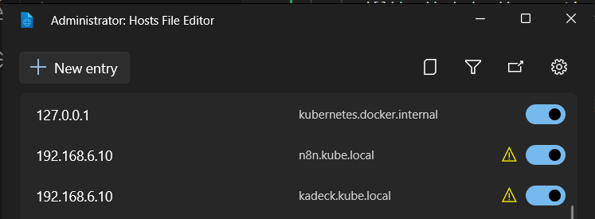

# n-odematio-n
A custom Kubernetes Helm chart for n8n, a Workflow Automation Tool.
> Note: persistent volume for `n8n-main` is mount at `/mnt/data` by default.  
> See `templates\n8n-main.yaml` for more detail.

## Procedures
1. Edit config in values.yaml
2. Install n8n
    ```bash
    kubectl create namespace n8n

    helm install -n n8n n8n-instance --wait --timeout=180s . 
    ```
3. Access through `https://n8n.kube.local/`
    > Ensure port 80 is enabled in firewall.  
    > centos: `sudo firewall-cmd --add-port=80/tcp`
    
    

## References
1. https://github.com/n8n-io/n8n-eks-cluster
1. https://kubernetes.io/docs/tasks/configure-pod-container/configure-persistent-volume-storage/
1. https://kubernetes.io/docs/concepts/services-networking/ingress/
